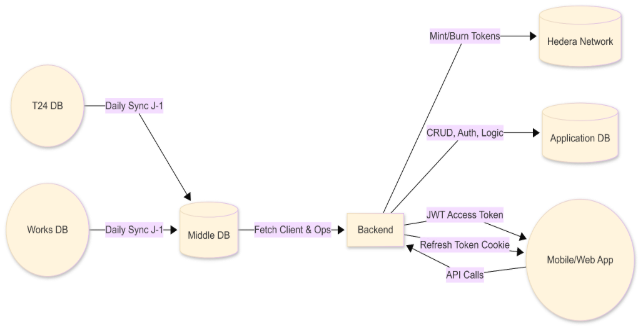
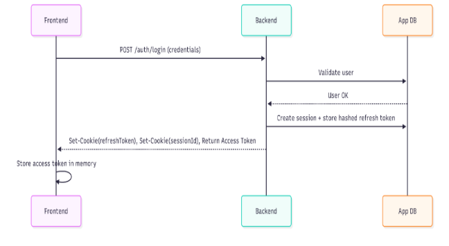
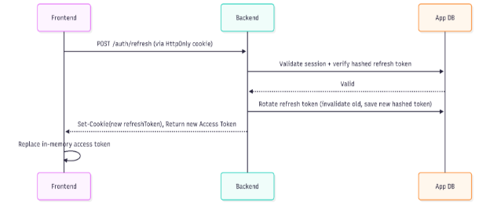
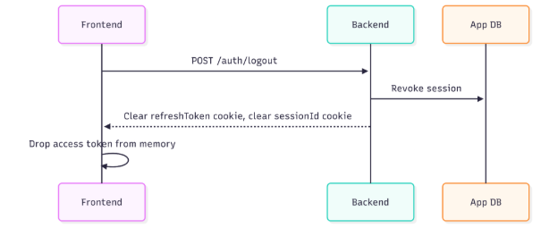
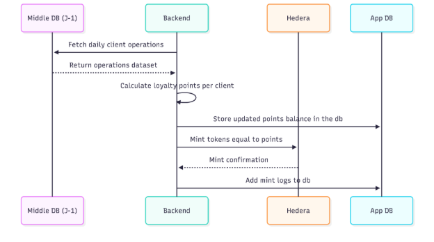
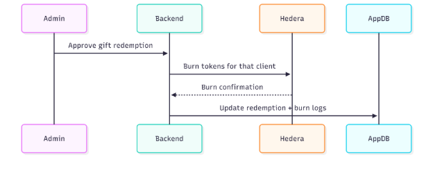

# **Enda Tamweel HTS-Based Loyalty Tokenization Platform**

|**Version:**|1\.0|
| :- | :- |
|**Date Last Updated:**|December 11, 2025|
|**Author/Owner:**|Dar Blockchain Team|

[**Enda Tamweel HTS-Based Loyalty Tokenization Platform	1**](#_heading=h.478aqd25hqnt)

[1. Introduction	3](#_heading=h.1iipknr1o5g1)

[2. High-Level Overview	3](#_heading=h.ae2xm7lg29h4)

[3. Key Functional Requirements	4](#_heading=h.ljzlfi8rcyav)

[3.1 User Management	4](#_heading=h.9ox2j2g2yl79)

[3.2 Loyalty Points Management	4](#_heading=h.8rr2n8ey0spl)

[3.3 Token Lifecycle	4](#_heading=h.8vurrm7msai5)

[3.4 Gift Redemption	5](#_heading=h.ihqljoccfv3n)

[4. System Architecture	5](#_heading=h.nthgne2rbiah)

[4.1 Components	5](#_heading=h.qr0x8u5bpfr3)

[4.2 Data Flow	6](#_heading=h.p9x17q3iszfy)

[5. Token Architecture	7](#_heading=h.jhuyixorm6zh)

[5.1 Token Properties	7](#_heading=h.c4igbp82b8v)

[5.2 Wallet Architecture	7](#_heading=h.82rzwx10iq9u)

[6. Access Control	7](#_heading=h.n56mfz5uxhft)

[6.1 Roles	7](#_heading=h.xort3wsasbfq)

[6.2 Security	7](#_heading=h.4r9b0ogbw0ri)

[7. Authentication Mechanism	8](#_heading=h.xwfkw1qztne0)

[7.1 JWT Access Token	8](#_heading=h.jv1yyi5j6b3r)

[7.2 Refresh Token	8](#_heading=h.wsamj1r0vbxm)

[7.3 Session Flow	8](#_heading=h.iczty5rxlisd)

[7.4 Logout Process	9](#_heading=h.vyzatot0y7bw)

[7.5 Security Controls	9](#_heading=h.gp6xrvcfyv20)

[8. Integration With Middle DB	9](#_heading=h.nfinonwfx5ns)

[9. Scalability Considerations	9](#_heading=h.dyh6vm2byy53)

[10. Architecture Diagrams	9](#_heading=h.m7r1qalhdjhg)

[10.1 High-Level System Architecture	9](#_heading=h.nrc02ja40846)

[10.2 Authentication Diagrams	10](#_heading=h.o6owf09a9rwo)

[10.2.1 Login & Token Issuance Flow	10](#_heading=h.xsiuaxomrvqu)

[10.2.2 Access Token Expiry & Refresh Flow	11](#_heading=h.ae4xzi35cw93)

[10.2.3 Logout Flow	11](#_heading=h.ddft444ssgl5)

[10.3 Daily Points Calculation & Tokenization Flow	11](#_heading=h.8vscbfic6u8g)

[10.4 Gift Redemption & Token Burning Flow	12](#_heading=h.v02ndfs4o265)

[11. Conclusion	12](#_heading=h.tcx016nrqhyl)

##
##
##
##
##
##
##
##
##
##
##
## **1. Introduction**
This document presents the technical architecture for Enda Tamweel’s loyalty and client fidelization system. The platform manages client points using traditional databases combined with Hedera Hashgraph’s HTS (Hedera Token Service). Points are tokenized as a mintable, and burnable HTS token. These tokens reflect the points accumulated by each client.

The platform integrates Enda Tamweel’s existing T24 and Works systems through an intermediate consolidated database (Middle DB), which is updated daily (J-1). Based on the extracted data, daily points are calculated for each client, stored, and reflected in their token balances.
## **2. High-Level Overview**
1\.      Client data is sourced from Enda Tamweel’s Middle DB (daily refreshed J-1).

2\.      On registration, each client is assigned a Hedera account.

3\.      A dedicated HTS token represents the loyalty points.

4\.      Each day:

o   Points are calculated based on the Middle DB data.

o   Points are stored in the application database.

o   Points are minted to clients Hedera accounts.

5\.      Points cannot be used externally.

6\.      Admins verify client gift redemption requests. Once approved, the corresponding tokens are burned.

7\.      A Super Admin manages Admin accounts.

8\.      The platform backend and API ensure secure communication between all components.
## **3. Key Functional Requirements**
### **3.1 User Management**
·         Automatic Hedera wallet creation on registration.

·         Secure storage of user wallet credentials (private keys encrypted).

·         Ability for Admins to manually create clients.

·         Super Admin panel for Admin lifecycle management.
### **3.2 Loyalty Points Management**
·         Daily extraction of client activity from Middle DB.

·         Rule-based points calculation engine.

·         Storage of historical point calculations.

·         Automatic minting of calculated points using the HTS token.
### **3.3 Token Lifecycle**
·         Mintable and burnable.

·         Only the platform admin key can mint/burn.

·         Regular reconciliation between DB and on-chain balances.
### **3.4 Gift Redemption**
·         Client requests a gift exchange.

·         Admin approves or rejects.

·         If approved:

o   Tokens equivalent to the gift cost are burned from the client’s balance.

o   Transaction is logged in DB.
## **4. System Architecture**
### **4.1 Components**
·         **Middle DB**: Consolidates data from T24 and Works, updated daily.

·         **Backend Service** (NestJS):

o   Fetches Middle DB data.

o   Calculates and persists daily points.

o   Mints tokens via Hedera.

o   Exposes APIs for Admins, Super Admins, and Clients.

·         **Application DB (PostgreSQL)**:

o   User accounts.

o   Points calculation history.

o   Redemption requests.

o   Admin/Super Admin.

·         **Frontend (React/React Native)**:

o   Web Application.

o   Mobile Application.

·         **Hedera Network**:

o   HTS token management.

o   Account creation.

o   Minting and burning.
### **4.2 Data Flow**
1\.      **Daily Data Sync**: Backend fetches Middle DB records.

2\.      **Points Engine**: Computes points using rules (loan behavior, user activity, payment events, etc.).

3\.      **DB Storage**: Saves daily snapshot and cumulative values.

4\.      **On-Chain Update**: Mints new points (HTS tokens) to each user account.

5\.      **Gift Redemption**:

o   Client → Request.

o   Admin → Approve.

o   Backend → Burn tokens.

o   DB → Log redemption.
## **5. Token Architecture**
### **5.1 Token Properties**
·         **Type**: Fungible HTS Token.

·         **Supply**: Infinite max; controlled via Admin Key.

·         **Features**:

o   Mintable.

o   Burnable.
### **5.2 Wallet Architecture**
·         Each user receives a Hedera Account (account ID + private/public key pair).

·         Keys stored encrypted in the backend database.

·         Admin account holds mint/burn authority.
## **6. Access Control**
### **6.1 Roles**
·         **Client**: View balance, redeem gifts.

·         **Admin**: Manage gifts, approve redemptions.

·         **Super Admin**: Manage Admin accounts, audit logs.
### **6.2 Security**
·         JWT-based authentication (short lived access token + long-lived refresh token).

·         Secure private key storage.

·         Encrypted communication (HTTPS).
## **7. Authentication Mechanism**
The platform uses a secure token-based authentication workflow designed to protect user sessions and prevent unauthorized access.
### **7.1 JWT Access Token**
- The access token is a short-lived JWT containing user ID, role, username.
- It is **never stored in localStorage or sessionStorage** to avoid XSS attacks.
- It is kept in the frontend’s in-memory context so it disappears when the page is closed.
### **7.2 Refresh Token**
- The refresh token is long-lived and generated on the backend.
- It is bound to a specific session and stored in the database.
- It is sent to the client as an **HTTP-only, Secure cookie**, making it inaccessible to JavaScript.
- Each time a refresh request is made, the backend **rotates** the refresh token by:
  - Validating the existing one.
  - Invalidating it in the database.
  - Issuing a new rotated refresh token + new access token.
### **7.3 Session Flow**
1. User logs in → backend issues access token + refresh token cookie + session id cookie.
1. Frontend stores access token in memory only.
1. When the access token expires, the frontend calls the refresh endpoint.
1. Backend validates and rotates the refresh token.
1. Backend returns a fresh access token.
1. The user continues seamlessly without re-authentication.
### **7.4 Logout Process**
- On logout, the session is revoked from the database.
- The refresh token cookie is cleared.
- Access token is dropped from frontend memory.
### **7.5 Security Controls**
- Refresh tokens hashed before storing in DB.
- Strict cookie settings: HttpOnly, Secure.
- Complete audit logs for login, logout, and refresh events.
## **8. Integration With Middle DB**
·         Nightly cron job or scheduled task.

·         Read-only access to the Middle DB.

·         Logging for each import session.
## **9. Scalability Considerations**
·         Asynchronous job queue for daily point calculation.

·         Batch mint operations.
## **10. Architecture Diagrams**
Below are visual diagrams that describe the data flow and system interactions.
### **10.1 High-Level System Architecture**

### **10.2 Authentication Diagrams**

#### **10.2.1 Login & Token Issuance Flow**

#### **10.2.2 Access Token Expiry & Refresh Flow**

####
#### **10.2.3 Logout Flow**

### 
### **10.3 Daily Points Calculation & Tokenization Flow**

### **10.4 Gift Redemption & Token Burning Flow**

## **11. Conclusion**
The loyalty platform bridges traditional banking systems with modern tokenization using Hedera HTS. It ensures transparency, immutability, and ease of management while maintaining strict control of point flows. With clear role separation, secure wallet management, and daily automated minting, the system is built for reliability and future scalability.

